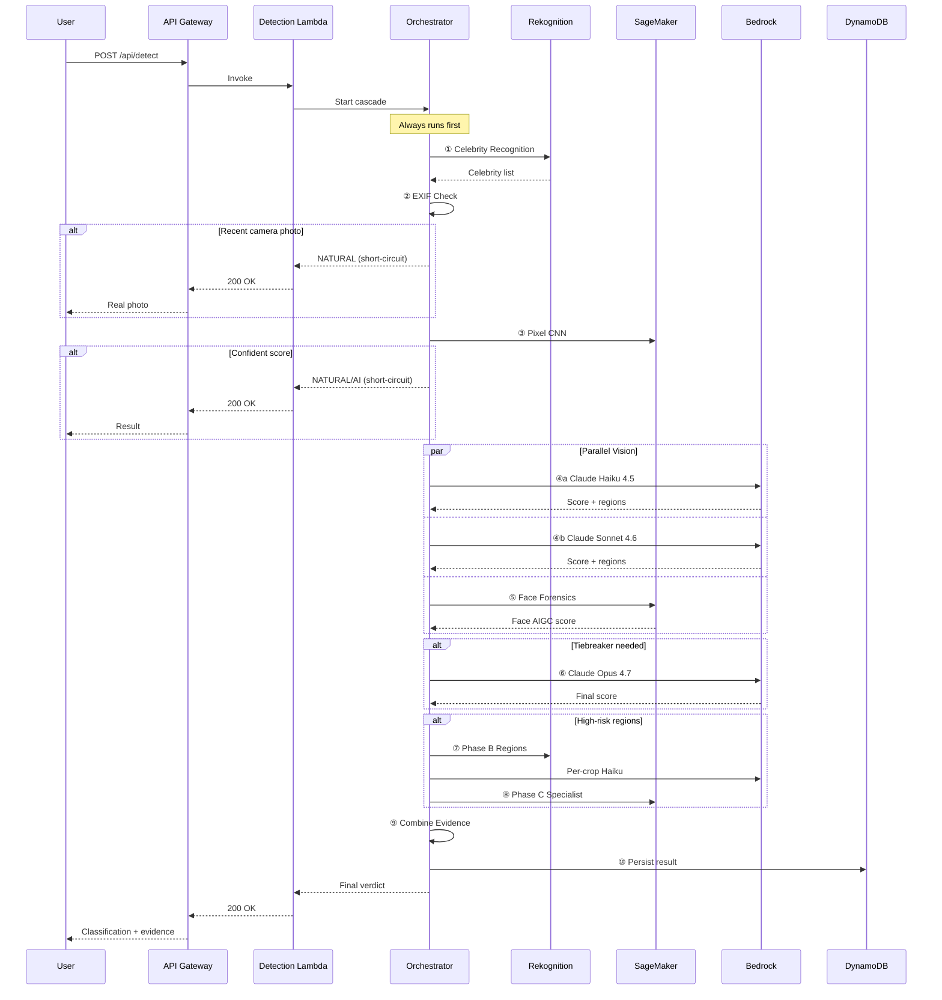

# Architecture Diagram

## System Overview

```mermaid
graph TB
    subgraph "User Layer"
        Browser[🌐 Browser]
    end
    
    subgraph "CDN & Edge"
        CloudFront[☁️ CloudFront]
        Edge[λ@Edge Auth]
        S3Web[🪣 S3 Web Bucket]
    end
    
    subgraph "API Layer"
        API[⚡ API Gateway]
        DetectLambda[λ Detection]
        HealthLambda[λ Health]
        UploadLambda[λ Upload URL]
        SessionLambda[λ Session Check]
        S3EventLambda[λ S3 Event]
    end
    
    subgraph "Storage"
        S3Intake[🪣 S3 Intake Bucket]
        DDB[(🗄 DynamoDB<br/>detection-results)]
        Secrets[🔐 Secrets Manager]
        KMS[🔑 KMS]
    end
    
    subgraph "AI Services"
        Bedrock[Amazon Bedrock<br/>Claude Haiku 4.5<br/>Claude Sonnet 4.6<br/>Claude Opus 4.7]
        SageMaker[Amazon SageMaker<br/>Pixel CNN<br/>AIGC Ensemble<br/>Composite Specialist]
        Rekognition[Amazon Rekognition<br/>Celebrities<br/>Face Detection<br/>Region Analysis]
    end
    
    subgraph "Monitoring & Alerts"
        CloudWatch[📊 CloudWatch]
        SNS[📣 SNS Alerts]
    end
    
    Browser --> CloudFront
    CloudFront --> Edge
    CloudFront --> S3Web
    CloudFront --> API
    
    API --> DetectLambda
    API --> HealthLambda
    API --> UploadLambda
    API --> SessionLambda
    
    UploadLambda --> S3Intake
    S3Intake --> S3EventLambda
    
    DetectLambda --> Orchestrator
    S3EventLambda --> Orchestrator
    
    SessionLambda --> Secrets
    
    Orchestrator --> DDB
    Orchestrator --> Bedrock
    Orchestrator --> SageMaker
    Orchestrator --> Rekognition
    Orchestrator --> SNS
    
    DetectLambda -.-> CloudWatch
    S3EventLambda -.-> CloudWatch
    CloudWatch --> SNS
    
    subgraph "Inline Orchestrator (10-step cascade)"
        Orchestrator[① Rekognition Celebrities<br/>② EXIF Check<br/>③ SageMaker Pixel CNN<br/>④ Claude Haiku + Sonnet parallel<br/>⑤ Face Forensics<br/>⑥ Claude Opus Tiebreaker<br/>⑦ Phase B: Regions + Crops<br/>⑧ Phase C: Specialist<br/>⑨ Combine Evidence<br/>⑩ Persist to DynamoDB]
    end
    
    style Browser fill:#1a1d27,stroke:#6366f1,color:#e2e8f0
    style CloudFront fill:#1a1d27,stroke:#f59e0b,color:#e2e8f0
    style API fill:#1a1d27,stroke:#22c55e,color:#e2e8f0
    style DetectLambda fill:#1a1d27,stroke:#6366f1,color:#e2e8f0
    style Orchestrator fill:#0f1117,stroke:#6366f1,stroke-width:3px,color:#e2e8f0
    style Bedrock fill:#1a1d27,stroke:#6366f1,color:#e2e8f0
    style SageMaker fill:#1a1d27,stroke:#22c55e,color:#e2e8f0
    style Rekognition fill:#1a1d27,stroke:#f59e0b,color:#e2e8f0
    style DDB fill:#1a1d27,stroke:#6366f1,color:#e2e8f0
    style SNS fill:#1a1d27,stroke:#ef4444,color:#e2e8f0
```

## Detection Cascade Flow



## Key Components

| Component | Purpose | Technology |
|---|---|---|
| **CloudFront** | CDN + Lambda@Edge auth | CloudFront + Lambda@Edge |
| **API Gateway** | REST API endpoints | API Gateway REST |
| **Detection Lambda** | Main detection orchestrator | Lambda Python 3.12 |
| **Inline Orchestrator** | 10-step cascade logic | In-process Python |
| **Rekognition** | Celebrity + face + region detection | Amazon Rekognition |
| **SageMaker** | Pixel CNN + AIGC + Specialist | SageMaker Serverless |
| **Bedrock** | Claude Haiku/Sonnet/Opus | Bedrock Global Inference |
| **DynamoDB** | Detection results + cache | DynamoDB PAY_PER_REQUEST |
| **S3** | Image intake + web assets | S3 Standard |
| **CloudWatch** | Metrics + alarms | CloudWatch |
| **SNS** | High-confidence alerts | SNS |

## Deployment Architecture

- **Primary Region**: us-east-1
- **Bedrock Region**: eu-west-1 (Global Inference Profiles)
- **SageMaker**: Serverless endpoints (scale-to-zero)
- **Lambda**: X86_64 Python 3.12, 3008 MB
- **API Gateway**: 29s integration timeout (configurable to 120s)
- **CloudFront**: Global edge network
